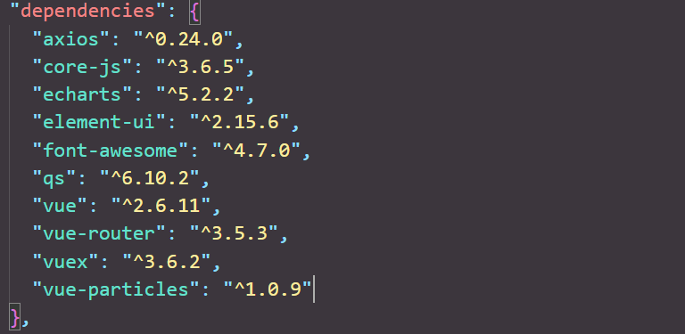
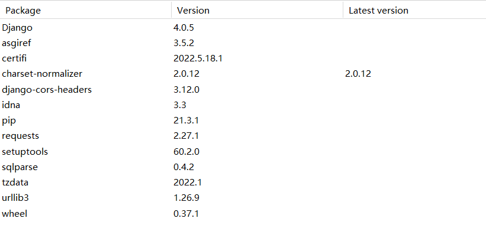

# Anti epidemic material management system

编写人员：刘梦豪

## 项目简介

2022春**应用软件设计**课程大作业——基于**vue**+**Django**的前后端分离的抗疫物资管理系统

## 项目成员

张鹏、钱弘一、刘梦豪、李若骐、庞渝昊

## 部署运行

### 环境依赖

- **Python**——3.9以上
- **Vue-cli**

#### 前端依赖



#### 后端依赖



### 项目运行

```bash
# 后端运行

# 生成数据库同步文件
python manage.py makemigrations
# 同步数据库
python manage.py migrate
# 运行
python manage.py runserver

# 前端运行

# 安装依赖
npm install
# 启动服务 
npm run serve
# 构建生产环境
npm run build
```

