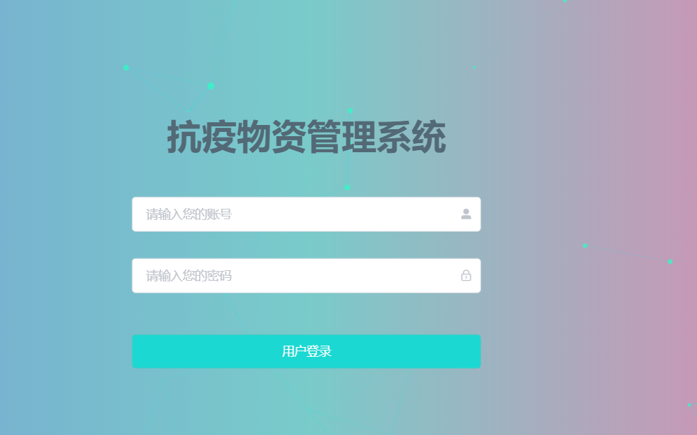
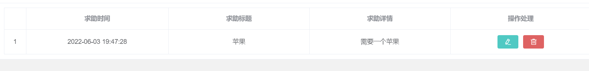

[TOC]

# 测试文档

编写人员：张鹏

## 启动项目

cd project\outbreaks
python manage.py runserver

执行在http://127.0.0.1:8000/无法直接打开。

cd project\client

npm run serve

前后端同时启动后访问http://localhost:8080/访问项目

## 登录用户

初始设定用户为admin1、admin2、admin3、admin4，密码与用户名相同

admin1、admin2为管理员用户，admin3、admin4为普通用户

输入admin1，admin1登录管理员账号，首页显示正常

## 系统首页

右上角修改个人信息

修改密码

首页移动光标至图表上可以看到具体信息

## 用户管理

切换至用户管理，正常显示现有用户

加号添加用户

也可以进行用户编辑以及删除。

也可输入进行搜索

## 物资管理

基本操作与之前类似，添加如下表的物资信息，可以看到添加成功

| 1    | 一次性筷子 | 001  | 2箱  | 公司捐赠 | 2022-06-03 | 其他     | 柯南 |      |
| ---- | ---------- | ---- | ---- | -------- | ---------- | -------- | ---- | ---- |
| 2    | 口罩       | 002  | 三箱 | 社会购买 | 2022-06-02 | 医护用品 | 柯南 |      |

删除一次性筷子成功

## 入出库记录管理

添加如下信息

| 1    | 2022-06-03 | 口罩   | 柯南 | 入库 |      |
| ---- | ---------- | ------ | ---- | ---- | ---- |
| 2    | 2022-06-03 | 消毒水 | 柯南 | 出库 |      |

添加成功

搜索口罩

删除

## 求助信息管理

添加求助信息

| 苹果 | 需要一个苹果 |
| ---- | ------------ |

首页显示

## 统计数据管理

显示正常

点击数据同步

同步成功

