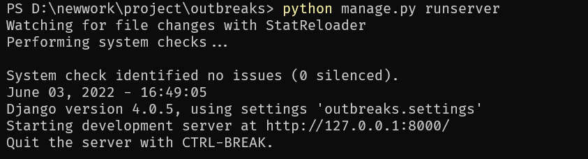
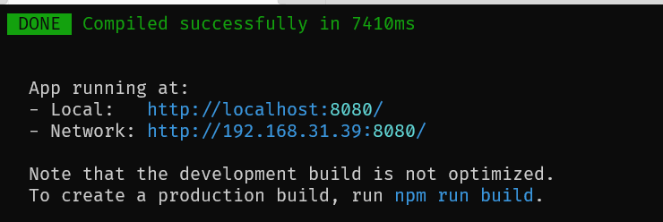

# 部署文档

编写人员：张鹏

## 后端项目部署
### 基本准备

安装python 3.10
安装pip

### 安装相关依赖

pip install django
pip install requests
pip install django-cors-headers

### 迁移数据库

python manage.py makemigrations
python manage.py migrate

### 项目执行

cd project\outbreaks
python manage.py runserver

执行在http://127.0.0.1:8000/无法直接打开。

## 前端项目部署

### 基本准备

安装npm
安装VUE

### 安装相关依赖

cd project\client
npm install

### 项目执行

npm run serve

前后端同时启动后访问http://localhost:8080/访问项目

## 登录用户

初始设定用户为admin1、admin2、admin3、admin4，密码与用户名相同

admin1、admin2为管理员用户，admin3、admin4为普通用户
